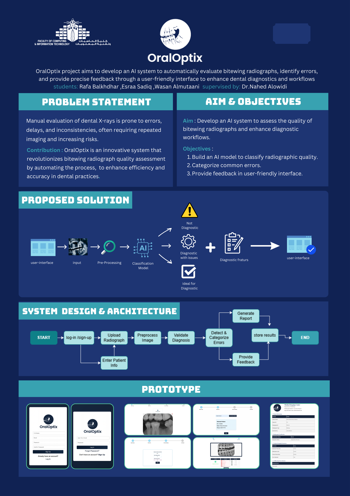
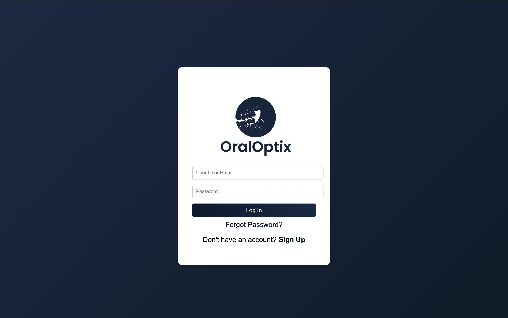
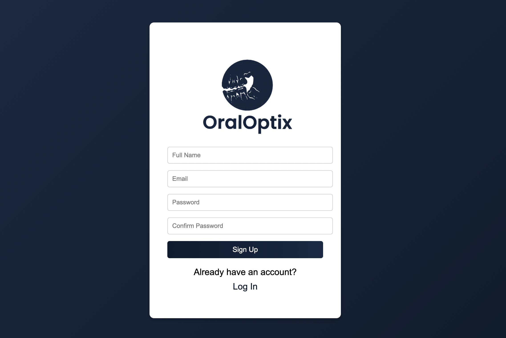
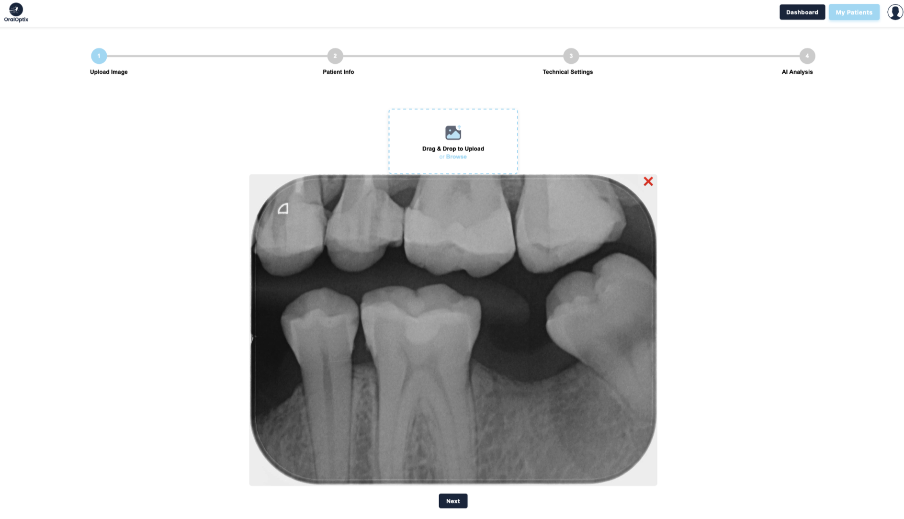
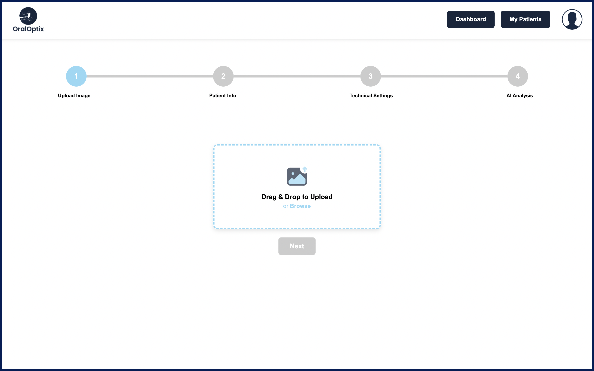
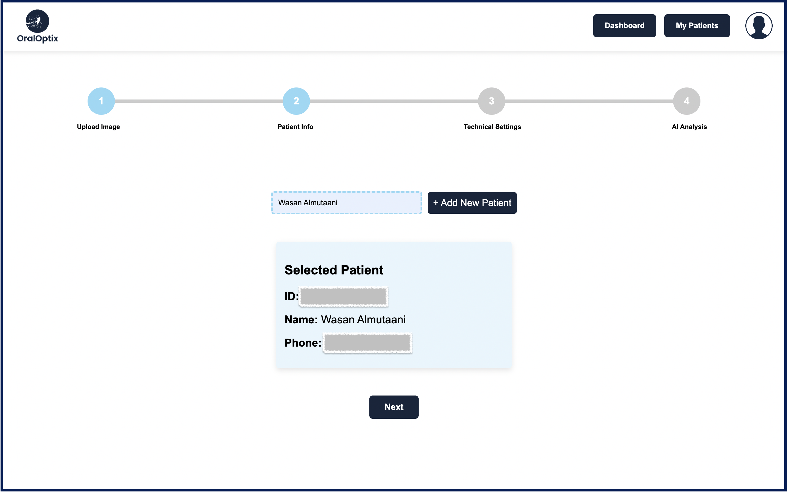
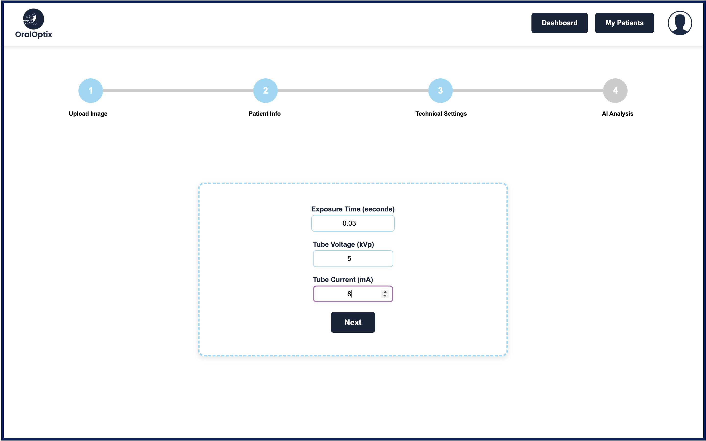
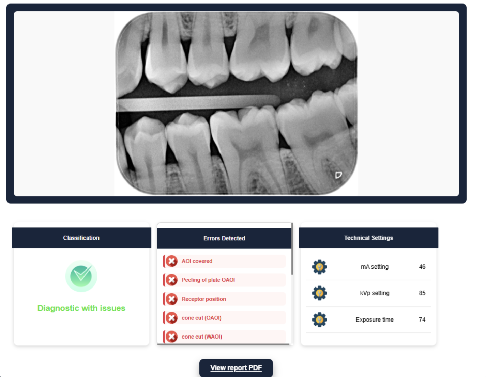
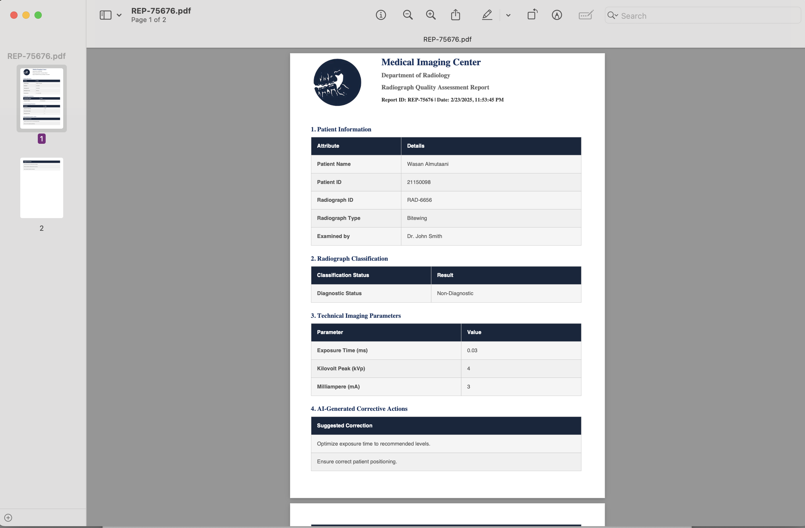

<!-- =========================================================
OralOptix • README
Professional GitHub README for Graduation / Research Project
========================================================= -->

<p align="center">
  
</p>

<p align="center">
  <b>Intelligent Assessment of Intra-Oral Radiograph Quality</b><br/>
  AI-assisted quality assessment and reporting workflow for bitewing dental radiographs.
</p>

<p align="center">
  
  
  
  
  
</p>

---

## Abstract

**OralOptix** is an academic artificial intelligence project developed to support the **quality assessment of intra-oral dental radiographs**, particularly **bitewing radiographs**.

The system demonstrates a prototype workflow combining:

- structured clinical-style interface  
- AI-assisted image quality analysis  
- report-oriented output generation  
- patient and imaging parameter documentation  

The goal of the project is to explore how **machine learning can assist clinicians in identifying radiograph quality issues**, reducing repeated imaging and improving workflow consistency.

This repository serves as the **official academic documentation and portfolio record** of the project.

---

## Clinical Motivation

Dental radiographs play a critical role in diagnosis.  
However, poor-quality images may lead to:

- non-diagnostic radiographs  
- repeated imaging and unnecessary radiation exposure  
- workflow delays in clinical environments  
- variability in manual quality evaluation  

**OralOptix** proposes a prototype AI-assisted workflow that helps classify radiograph quality and provide structured feedback for quality review.

---

## Important Notice

> This repository contains **prototype interfaces, academic materials, and demonstration outputs**.  
> All patient names, IDs, and report data appearing in screenshots are **demo/test data only** and **not real patient data**.

This repository is shared for **academic, educational, and portfolio purposes**.

---

## Project Scope

This repository documents the **academic prototype version** of OralOptix.

Included materials:

- graduation project report  
- presentation slides and poster  
- prototype interface screenshots  
- documentation notes  
- data governance notes  

### Not Included

The following materials are intentionally **not included in this public repository**:

- private training datasets  
- sensitive clinical data  
- full internal training pipeline  
- production deployment environment  

---

## Target Audience

This repository is intended for **medical imaging AI researchers, computer vision students, graduation project reviewers, and clinicians interested in AI-assisted radiograph quality assessment workflows**.

---

## Task Definition

The project investigates **automatic quality classification of bitewing dental radiographs** using deep learning models.

The classification task focuses on determining **diagnostic usability and quality characteristics of intra-oral radiographs**, supporting structured feedback within a prototype clinical workflow.

---

## Data Governance

The dataset used in this project is **not publicly included in this repository** due to privacy and academic data-sharing boundaries.

Only **documentation, results, and demonstration outputs** are shared publicly, while raw data and internal training assets remain restricted.

---

## System Overview

OralOptix follows a **workflow-based radiograph review process**.

### Workflow

1. Upload bitewing radiograph  
2. Select or add patient information  
3. Enter imaging technical parameters  
4. Perform AI-assisted quality analysis  
5. Generate structured report output  

### Main Components

- authentication interface (prototype)  
- patient management module  
- image upload and parameter form  
- AI analysis dashboard  
- structured report output interface  

---

## Key Features

### Multi-Step Radiograph Workflow

The interface guides users through a structured analysis process:

- patient selection  
- image upload  
- technical settings entry  
- automated analysis  
- report generation  

### Patient Management Interface

The prototype includes patient management capabilities:

- viewing patient records  
- searching records  
- adding new patients  
- editing patient data  

### AI-Assisted Reporting

Generated reports summarize:

- patient metadata (demo)  
- radiograph classification  
- imaging parameters  
- AI-generated quality recommendations  

---

## Problem and Solution

<p align="center">

</p>

### Problem

Manual radiograph quality checking may be inconsistent and time-consuming.  
Low-quality images can lead to repeat imaging and unnecessary radiation exposure.

### Proposed Approach

OralOptix demonstrates a **prototype AI-assisted workflow** that:

- evaluates radiograph quality  
- classifies diagnostic usability  
- provides structured feedback through a report interface  

---

## AI Research Context

The project explores **deep learning approaches for dental radiograph quality classification**.

Research directions include:

- medical imaging AI  
- dental radiograph quality assessment  
- deep learning model comparison  
- workflow support for clinicians  
- structured reporting for image quality  

---

## Model Performance Summary

| Model | Accuracy | Precision | Recall | F1 Score |
|------|----------:|----------:|-------:|---------:|
| MobileNetV3 Small | 97.26% | 97.28% | 97.26% | 97.21% |
| **EfficientNetB0** | **98.63%** | **98.83%** | **98.63%** | **98.63%** |
| Vision Transformer (ViT) | 84.93% | 92.67% | 84.93% | 87.09% |
| EfficientNet + ViT Hybrid | 82.19% | 67.55% | 82.19% | 74.16% |
| MobileNetV3 + ViT Hybrid | 82.19% | 67.55% | 82.19% | 74.16% |
| Custom ViT-style | 89.04% | 93.07% | 89.04% | 90.09% |

**EfficientNetB0 achieved the strongest overall performance** in the project experiments.

Full details are available in the project report.

---

## Technical Stack

### AI Development
- Python  
- TensorFlow  
- Keras  
- CNN architectures  
- Vision Transformer models  
- Google Colab  

### Backend Prototype
- Flask  

### Frontend Prototype
- PHP  
- HTML  
- CSS  
- JavaScript  
- MySQL  
- phpMyAdmin  

---

## Repository Structure

```
OralOptix-AI-Bitewing-Quality-Assessment
│
├── assets
│
├── demo
│
├── docs
│   ├── methodology
│   ├── results
│   ├── limitations
│   └── future work
│
├── paper
│
├── presentation
│
├── report
│
├── data-governance
│
├── README.md
├── LICENSE
└── CITATION.cff
```

---

## Visual Preview

### Project Poster

<p align="center">

</p>

---

## Interface Walkthrough

### 1. User Authentication — Login

<p align="center">

</p>

---

### 2. User Registration — Sign Up

<p align="center">

</p>

---

### 3. Radiograph Upload

<table>
<tr>
<td width="50%" align="center">

</td>
<td width="50%" align="center">

</td>
</tr>
</table>

---

### 4. Add Patient

<p align="center">

</p>

---

### 5. Technical Imaging Settings

<p align="center">

</p>

---

### 6. AI Analysis Dashboard

<p align="center">

</p>

---

### 7. Generated Report

<p align="center">

</p>

---

## Project Status

### Implemented Components

- [x] Dataset preparation and labeling  
- [x] Bitewing radiograph quality classification task  
- [x] Deep learning model experimentation  
- [x] Comparative evaluation of multiple architectures  
- [x] Performance analysis using Accuracy, Precision, Recall, and F1-score  
- [x] Prototype clinical workflow interface  
- [x] Radiograph upload workflow  
- [x] Patient management interface (prototype)  
- [x] Technical imaging parameter input  
- [x] AI-assisted radiograph quality assessment and report output  

### Future Research Directions

- [ ] Expansion to larger multi-institution radiograph datasets  
- [ ] Explainable AI visualization techniques  
- [ ] Integration with clinical radiology systems (e.g., PACS)  
- [ ] Real-time radiograph quality feedback during acquisition  
- [ ] Extension to additional intra-oral radiograph types  
