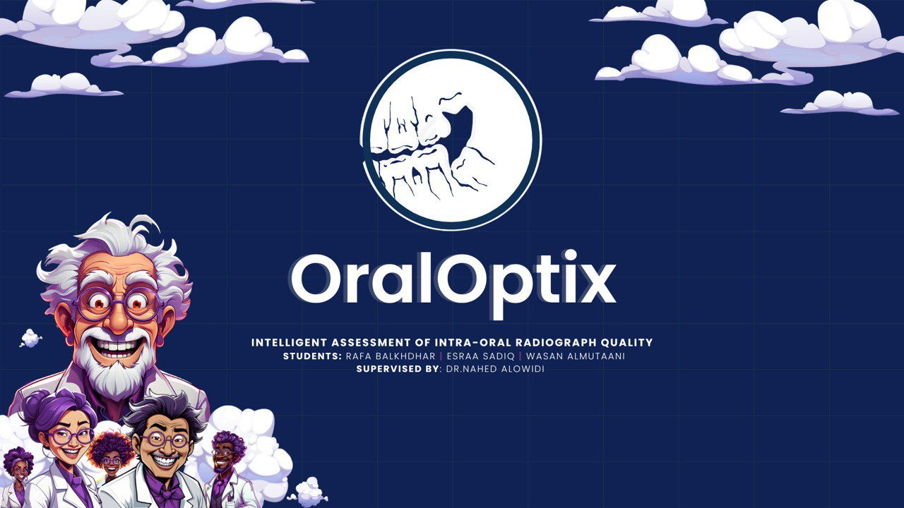

<!-- =========================================================
OralOptix • README
Professional GitHub README for Graduation / Research Project
========================================================= -->

<p align="center">
  
</p>

<h1 align="center">OralOptix</h1>

<p align="center">
  <b>Intelligent Assessment of Intra-Oral Radiograph Quality</b><br/>
  AI-assisted quality assessment and reporting workflow for bitewing dental radiographs.
</p>

<p align="center">
  
  
  
  
  
</p>

---

## Overview

**OralOptix** is an academic AI project designed to support the **quality assessment of intra-oral dental radiographs** (especially bitewing images) through an organized workflow and AI-assisted report generation.

The project combines:
- A structured user workflow (upload → patient info → technical settings → AI analysis)
- A patient management interface
- AI-generated radiograph quality reports
- A clean clinical-style report output (PDF-ready format)


---

## Important Notice

> **This repository contains prototype interfaces, academic materials, and demonstration outputs.**  
> **All displayed patient names, IDs, and report data shown in screenshots are demo/test data only (not real patient data).**

This project is shared for **academic, educational, and portfolio purposes**.

---

## Key Features

### 1) Multi-Step Clinical Workflow
A structured and easy-to-follow workflow for radiograph analysis:

1. Upload radiograph image
2. Select or add patient information
3. Enter technical imaging parameters
4. Generate AI-assisted quality assessment output

---

### 2) Patient Management Module
The interface includes a patient management page that supports:
- Viewing patients
- Searching records
- Adding new patients
- Editing patient details
- Basic UI actions for record management

---

### 3) AI-Generated Report Output
The system generates a radiograph quality assessment report containing:
- Patient metadata
- Radiograph classification (e.g., diagnostic / non-diagnostic)
- Technical imaging parameters
- AI-generated corrective recommendations

---

### 4) Professional Visual Design
The user interface follows a consistent visual identity:
- Clean healthcare-inspired theme
- Strong contrast and readable layout
- Reusable UI components
- Presentation-ready visuals for demos and academic presentations

---

## Problem and Solution

<p align="center">
  
</p>

**Problem addressed:**  
Manual quality checking of dental radiographs can be inconsistent and time-consuming, and repeated imaging may increase unnecessary radiation exposure.

**OralOptix approach:**  
Provide an AI-assisted workflow to help classify radiograph quality and suggest corrective actions in a structured, report-oriented interface.

---

## Repository Structure

```bash
OralOptix/
│
├── assets/                 # UI screenshots, banner, poster, and visual assets
├── demo/                   # Demo media or walkthrough material (if available)
├── docs/                   # Documentation (setup notes, system description, etc.)
├── paper/                  # Research paper / manuscript files (if available)
├── presentation/           # Presentation slides and presentation resources
├── report/                 # Project report PDFs, generated report examples
├── data-governance/        # Data handling notes, privacy and governance docs
│
├── README.md               # Project overview and documentation
├── LICENSE                 # Project license
└── CITATION.cff            # Citation metadata for academic referencing
